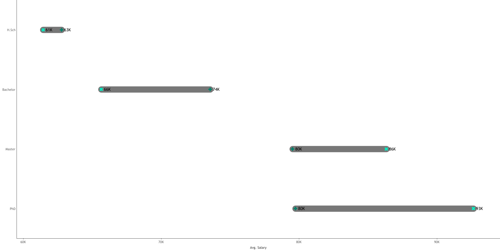

# Workforce Analytics & HR Performance Dashboard

## Summary
Designed a dual-view business intelligence solution enabling Human Resources stakeholders to monitor workforce dynamics, retention trends, and compensation equity across **8,950+ employee records**. By integrating strategic KPIs with granular employee details in **Tableau**, from this, we can identify turnover risks, gender pay gaps, and performance correlations which redues time-to-insight for workforce planning.

🔗 **Interactive Dashboard:**  
[View the live Tableau Public dashboard](https://public.tableau.com/app/profile/finbar.kizito/viz/HRdashboard_17697193047110/HRISummary)

---

## Business Problem
The HR department lacked a consolidated, decision-ready view of workforce data and relied on fragmented reports to answer critical organisational questions. Leadership faced uncertainty around:

- **Retention Health:** Are we losing talent at an accelerating rate, and which departments experience the highest churn?
- **Compensation Equity:** Do salary disparities exist between genders across education levels?
- **Demographic Risk:** Is our workforce aging and at what rate, and is there over-reliance on HQ-based talent versus regional branches?
- **Performance Drivers:** Is there a measurable relationship between education level and employee performance?

---

## Methodology & Skills Demonstrated

**Tools:** Tableau Public · Python · Figma  

### Analytical Approach

- **Data Engineering & Preparation**
  - Generated an HR dataset using **Python** to simulate realistic hire dates, termination logic, salaries, and performance ratings.
  - From this, data tyes were validated and heirarchical relatonships (Department → Job Title).

- **KPI Logic & Calculations**
  - Classified **Active vs. Terminated** employees using `IF/THEN` logic with `ISNULL` checks on termination dates.
  - Computed **Employee Age** and **Tenure** dynamically using `DATEDIFF` relative to the current date.
  - Created **Age Bands** and **Salary Bins** to support segmentation analysis.

- **Advanced Tableau Techniques**
  - **Gap Analysis (Dual-Axis):** Visualised gender pay differentials using layered bar and reference mark techniques.
  - **Correlation Analysis:** Used scatter plots and heat maps to evaluate relationships between education, salary, and performance.
  - **Viz-in-Tooltip:** Embedded secondary charts in tooltips to enable the drill-down without disrupting dashboard context.

- **Dashboard Architecture & UX**
  - Designed a **two-layer navigation system** (Executive Summary vs. Employee Detail) using parameter actions and navigation buttons.
  - Implemented a high-fidelity background layout designed in **Figma** to improve visual hierarchy and user adoption.

---

## Insights

### Workforce Compensation & Capability Overview
This analysis consolidates multiple employee-focused dashboards to assess how compensation aligns with experience, education, and performance across the organisation. The objective is to move beyond descriptive reporting and identify structural strengths, governance watchpoints, and decision-relevant implications for workforce strategy.

---

### Compensation Scales with Experience, with Targeted Market Exceptions

  

Analysis of **salary versus age** shows a clear upward relationship between experience and compensation, indicating a coherent progression framework. Senior and managerial roles are appropriately concentrated in higher salary bands, while a subset of younger employees earn above-average pay, reflecting market pricing for specialist or high-impact roles.

**Implications**  
This pattern suggests a balanced compensation strategy that combines tenure-based progression with selective pay premiums for scarce skills. Such a structure supports competitiveness in tight labour markets without undermining internal pay coherence.

**Watchpoint:**  
More experienced employees earning below the company average represent a potential retention and engagement risk if progression pathways are unclear or constrained. This group warrants targeted monitoring rather than broad compensation restructuring.

---

### Education Delivers Consistent Returns Without Systemic Gender Distortion

  

<em>
Education level shows disciplined, monotonic salary increases.  
Gender differences are small at entry level and converge at higher qualifications.
</em>

Average salary increases consistently from **High School → Bachelor → Master → PhD**, indicating disciplined returns to education. Gender-based differences are minimal at entry level, widen modestly at Bachelor level, and narrow or disappear at higher qualifications, with PhD-level compensation appearing fully aligned.

**Implications**  
Compensation at higher qualification levels is primarily driven by skill scarcity and role criticality rather than gender. The absence of widening gaps at senior or specialist levels suggests no evidence of systemic gender bias in pay-setting.

**Watchpoint:**  
Bachelor-level variation merits deeper, role-normalised review to confirm whether differences reflect role mix and progression patterns rather than emerging structural misalignment.

---

### Performance Improves with Education but Plateaus at Higher Levels
Performance ratings improve materially from lower to mid education levels, with fewer low-performance outcomes among Bachelor and Master-qualified employees. At Master and PhD levels, performance distributions stabilise, indicating diminishing marginal returns from additional qualifications.

**Implications**  
Education strengthens baseline capability, but long-term performance differentiation is driven more by role fit, execution, and scope of responsibility than by credentials alone. This reinforces the importance of development, leadership, and role design at senior levels.

---

### Takeaway
Overall, the evidence points to a well-structured compensation and talent framework as pay progression is aligned with experience and qualifications, market premiums are applied selectively for critical skills, and no systemic gender bias is observed at senior levels. That being said, the few risks identified are contained and addressable, indicating a need for focused refinement rather than wholesale change.

---
### Performance Outcomes Scale Systematically with Education Level
Analysis of **performance ratings by education level** shows a clear and monotonic improvement in outcomes as qualification level increases. At the High School level, performance is concentrated in *Needs Improvement* and *Satisfactory* ratings, while Bachelor-qualified employees form a stable professional core dominated by *Good* performance. Master’s-qualified employees mark an inflection point, with the majority rated *Good* or *Excellent*, and PhD holders are strongly skewed toward *Excellent* outcomes.

**Implications:**  
This pattern indicates that the organisation has effectively aligned **role complexity, responsibility, and expectations** with qualification level. Education is being used as an input into role design rather than as a blunt signalling mechanism, resulting in declining underperformance and increasing excellence at higher levels. This provides a defensible basis for differentiated compensation, selective development investment, and focused retention of highly specialised talent.

**Watchpoint:**  
Lower performance concentration at the High School level reflects role scope rather than capability. These roles require structured supervision, training, and performance management, not aggressive differentiation or high-powered incentives.

---

### Retention Is Uniformly Strong Across Hiring Cohorts
Cohort-based retention analysis shows end-of-year retention consistently between **83% and 94%** across all hire years from 2015 to 2024. There is no evidence of cohort collapse, no post-hire attrition spike, and no structural break associated with the post-2020 period. Apparent strength in the most recent cohorts reflects right-censoring rather than a true improvement trend.

**Implications:**  
This is a **high-retention organisation**, and workforce size outcomes are driven primarily by **hiring volume rather than employee exits**. Changes in headcount reflect management decisions about when and how much to hire, not underlying retention failure. As a result, growth constraints sit in recruiting capacity and budget, not attrition control.

**Watchpoint:**  
Given retention is not the limiting factor, analytical and managerial focus should shift away from “why people leave” toward **where, when, and why the firm chooses to hire**, as well as risks associated with role misallocation, skill obsolescence, and cost rigidity during downturns.

---
## Business Recommendations

1. **Pay Equity Audit:** Conduct a focused compensation review for Bachelor’s-degree roles to address identified gender pay gaps and reduce legal and reputational exposure (Could this be due to hours worked?).
2. **Talent Distribution Strategy:** Reduce dependency on HQ-based talent by incentivising hiring and retention in regional branches.
3. **Targeted Upskilling:** Introduce development programmes for employees with High School levels of education to improve performance outcomes.
4. **Retention Intervention:** Use the detailed employee view to flag high-performing staff with tenure >5 years for proactive retention discussions.

---

## Limitations & Next Steps

- **Live Integration:** Future iterations should connect to an HRIS API (e.g. Workday, BambooHR) for real-time reporting.
- **Attrition Tracking:** Churn rate analysis requires historical snapshots; a future enhancement would involve warehouse-style snapshot tables to enable month-over-month attrition tracking.

---
