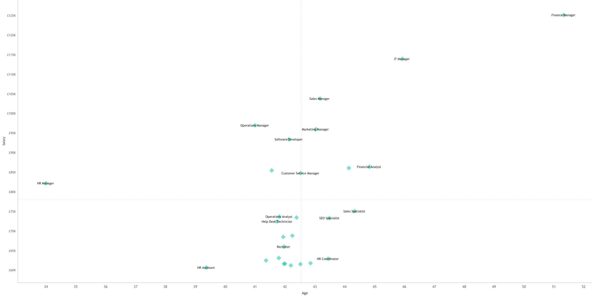

## Compensation Analysis Overview

  

This analysis examines employee compensation using a scatter plot of **salary (Y-axis)** against **age (X-axis)**, with reference lines marking the **average salary (£78k)** and **average age (43)**. These benchmarks divide the workforce into four distinct quadrants, each offering insight into how pay aligns with experience, role seniority, and skill value across the organisation.

This analysis examines employee compensation using a scatter plot of **salary (Y-axis)** against **age (X-axis)**, with reference lines marking the **average salary (£78k)** and **average age (43)**. These benchmarks divide the workforce into four distinct quadrants, each offering insight into how pay aligns with experience, role seniority, and skill value across the organisation.

## Interpretation of the Four Quadrants

The **upper-right quadrant (Age > 43 but Salary > £78k)** represents senior, experienced, and highly compensated employees. Roles such as Finance Manager and IT Manager appear in this space, which aligns with expectations for leadership, accountability, and domain expertise. From a compensation-governance perspective, this quadrant indicates a healthy reward structure where experience and responsibility are appropriately recognised, with no immediate signs of senior-level pay compression.

The **upper-left quadrant (Age < 43 but Salary > £78k)** captures relatively younger employees earning above the company average. This pattern is typically associated with specialist or high-impact roles, particularly in technical or commercially critical functions. The presence of employees here suggests the organisation is willing to pay for scarce skills and performance rather than relying purely on tenure-based progression, signalling competitiveness in tight labour markets.

The **lower-right quadrant (Age > 43 but Salary < £78k)** is the most sensitive area from a compensation-analysis standpoint. It contains more experienced employees whose pay sits below the organisational average. While this can reflect roles with flatter pay trajectories or non-managerial career paths, it also introduces potential risk around pay compression, progression ceilings, or perceived under-reward for experience. This quadrant warrants closer monitoring, especially if paired with higher attrition or lower engagement.

The **lower-left quadrant (Age < 43, Salary but £78k)** represents the early-career and junior workforce. Roles such as assistants, recruiters, and entry-level specialists are expected to cluster here. This is a structurally healthy quadrant, provided there are clear development and progression pathways into higher compensation bands over time.

## Overall Assessment of the Compensation Strategy

Overall, the company appears to operate a **coherent and largely market-aligned compensation structure**. Pay generally increases with age and implied experience, while still allowing for above-average compensation for high-value skills irrespective of age. This indicates a balanced approach that combines traditional career progression with selective market pricing.

The primary strategic watchpoint is the lower-right quadrant, where experienced employees earn below the company average. If sustained without progression opportunities, this pattern could translate into retention or morale risk. However, based on this view alone, there is no evidence of systemic misalignment or widespread inequity. The compensation framework appears deliberate, differentiated, and broadly defensible, with targeted areas for deeper role-level and tenure-based review rather than the need for wholesale restructuring.
