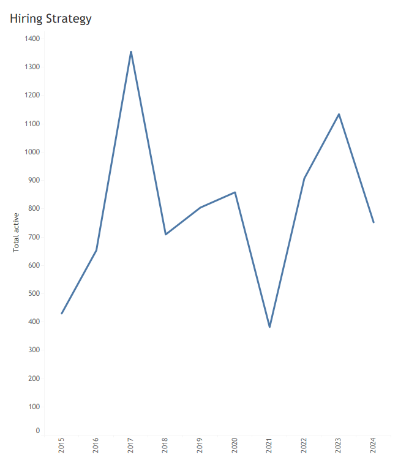

## What we see from the chart?

This heatmap shows **end-of-year retention by hire cohort**. For every cohort from **2015** through **2024**, retention at the latest observable tenure point sits between **83%** and **94%**. There is no cohort collapse i.e., no sharp post-hire attrition spike and no structural break between pre- and post-2020 (Covid) hiring.

The 2017–2021 cohorts retain **~87–91%** of staff at comparable tenure points (years 4–6). That places them statistically in line with, not above, earlier cohorts. Recent cohorts (2023–2024) show **~94% retention**, but those points are right-censored i.e., (too early for exits to materialise).

This is a high-retention organisation across all hiring waves.

## What we can rule out

* This company does **not** have a hiring-quality problem.
* It does **not** have a post-pandemic retention shock.
* Differences between cohorts are **single-digit percentage points**, well within what you would expect from normal variation given tenure length and censoring.

In other words: retention is **stable, not the differentiator**.

---

## The correct interpretation

Retention is **uniformly strong**, so **headcount outcomes are being driven by hiring volume, not people leaving**.

Analogy (to make this concrete):
This is a bucket with very low leakage. If the water level changes, it’s because you turned the tap up or down — not because the bucket is cracked.

---

## So what?

1. **Workforce size is a management choice, not an attrition outcome.**
   If leadership wants growth, the constraint is recruiting capacity and budget, not retention fixes.

2. **Do not over-interpret early-cohort strength.**
   The high retention in 2023–2024 is expected and will mechanically decline as tenure increases. Treat it as provisional, not proof of improvement.

3. **Stop spending analytics effort on “why people leave.”**
   The bigger lever is **where and when the firm hires**, not how it patches leaks that largely don’t exist.

4. **Strategic risk sits elsewhere.**
   With retention this high, risks shift to:

   * role misallocation,
   * skill obsolescence,
   * and cost rigidity during downturns.

---

## In a nutshell
This company retains people consistently well; changes in workforce capacity are driven almost entirely by hiring decisions, so the strategic question is not “how do we reduce attrition?” but “when, where, and why do we choose to hire.”

